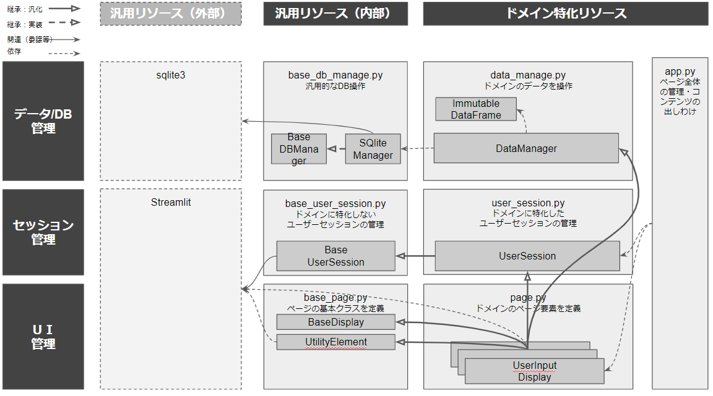
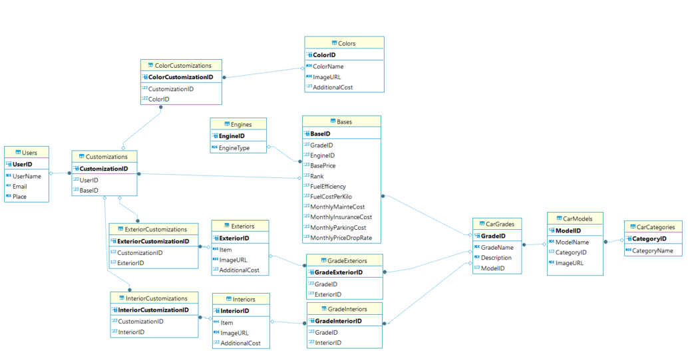

# アプリの概要
- Toyotaの[Webサイト](https://toyota.jp/carlineup/?padid=from_tjptop_menu_carlineup_header)を改善するプロジェクトの一環として構築したアプリです。
- 以下のようなユーザーにとって現在のサイトは使いにくく、その課題を解決するためのモックアプリを開発しました。


## ユーザーのペルソナ
- 車に経済合理性を追求するユーザー。比較検討になるべく時間をかけたくないと考えている。
- 車をファッションやステータスのためのものではなく、移動のためのツールだと捉えている。
- 予算や使い方、形状、色等、欲しい機能はある程度決まっている。
- 国産ブランドで信頼のおけるトヨタ車から検討を開始しており、ある程度納得できたら他社検討はせずそのまま購入してもよいと考えている
## ユーザーの課題
- 条件に合う車を見つけるまでに時間がかかってしまう
    - 車種からカスタマイズを選んでいくような検討しかサポートされていない。
    - 分かるのは初期コストだけであり、維持コストや売却見込み価格などは自分で見立てる必要がある。
    - 複数のカスタマイズ案を比較する機能がない。
## Toyotaにとっての課題
- **ユーザー離脱**: 検討が面倒なため、ユーザーが他社を検討する。
- **ユーザー・ディーラー満足度減**: ユーザーの中での検討が不十分な状態でディーラー予約。その結果、ディーラーへの訪問回数が多くなり、ディーラーとユーザーへの負担が大きくなってしまう。
- **ディーラーの対応悪化**: 購入につながりにくいことから、Webサイトから流入するユーザーに対するディーラーからの対応が悪化してしまう。
- **トヨタのブランドイメージ棄損**: 納得感がないまま購入したことで、購入後予想外のコストが発生し、トヨタ車への印象が悪くなってしまう。
## このアプリが提供する機能
- ユーザーが想定するライフサイクルコストから逆算して、条件に見合う車の一覧を提示し、分かりやすく比較します。
- この機能によってユーザーは検討の手間を省くことができ、ToyotaにとってはユーザーのコンバージョンUpが期待できます。

# 設計思想
## ソフトウェアアーキテクチャ

- 機能軸（縦軸）×抽象度軸（横軸）でクラスをデザインし、クラスの依存は、抽象→具象、セッション管理・DBデータ管理→UI管理の方向に統一しました。このようにすることで、リソースの再利用性を高めるとともに、依存関係を簡潔化することを意図しています。
- さらに、以下2点を重視して詳細の設計を行っています。
    1. UI関連のコンポーネントを複数人で分担して開発することを想定しており、開発者が知らないところで、共有リソースが変更されないようにしています。
        -  セッション変数（streamlit.user_session）へのアクセス制限、データフレームオブジェクトの修正制限を施しています。
    2. SQLを直接記述して実行できる箇所をDataManagerに限定することにより、SQLインジェクションなどの問題が発生しうる場所を限定しています。


### セッション管理
- **BaseUserSession**: ユーザーセッション管理の親クラス。事前に定義されていないstream.session_stateの変数が使用されないことを担保するために導入。ドメインに依存せず汎用的に使用できるメソッドをここで定義。開発者がsession_stateに直接アクセスした場合、github actionsのテストで検出し、テストでエラーを出すようにしている
- **UserSession**: BaseUserSessionの派生クラス。このアプリで使用する独自の機能（ユーザーがどの作業を完了しているのかを識別するフラグ設定など）を提供
### データ/DB管理
- **BaseDBManager**: データベース操作のための抽象クラス
- **SQLiteManager**: BaseDBManagerを具象化して作成したsqlite3を操作するためのクラス。ドメインによらず汎用的な機能（SQLの実行、レコード挿入など）を提供
- **ImmutableDataFrame**: 書き換え不能なデータフレームオブジェクトクラス。複数人の開発で、意図しないデータフレームの変更が発生しないように導入
- **DataManager**:SQLiteManager, ImmutableDataFrameの機能を使用し、本アプリに特化したDB操作機能（DBの初期化、予約時のレコード挿入、アプリで使用するデータの取得など）を提供。SQLiteManagerを継承せず、あえて一部の機能だけを有効化しているのは、DB操作箇所を集約化し、SQLインジェクションなどの不適切な操作が起きうる場所を限定するため
### UI管理
- **BaseDisplay**: ページの各要素の挙動を指定するための抽象クラス。各要素はこのクラスを具象化して作成する。preprocess / show / postprocessの3つの段階で構成することを要請し、各要素におけるユーザーとのインタラクションで発生するデータの変更が明示されるようにする。runメソッドを呼び出すことで、preprocess → show → postprocessの順に実行される
- **UtilityElement**: このアプリに寄らず汎用的に利用できる要素を定義
- **UseInputDisplay / SearchResultDisplay / etc**: BaseDisplayを具象化して作成、ページ要素を定義した派生クラス。必要に応じて、DataManager、UserSession、UtilityElementを多重継承し、開発者がそれぞれのニーズに応じて、DB操作機能、ユーザーセッション管理機能などを利用する。同一クラス内で共通利用する変数はselfを使用して管理し、クラス間で共通利用される変数はself.stateを介して共通利用する。self.stateを介してクラス横断で共通利用できる変数は./domain_context/default_values.pyに定義する

## データアーキテクチャ（ERD）

- 車両・部品関連
    - CarCategory: 選択可能な車両カテゴリ（SUVなど）
    - CarModels: 選択可能なモデル（車種）。車両カテゴリによって異なる
    - CarGrades: 選択可能なグレード。モデルによって異なる
    - Bases: 選択可能なベースの情報。エンジンのタイプや、燃費や維持費に関わる情報を含む
    - GradeExteriors: 選択可能な外装IDの一覧。選択可能な外装IDはグレードによって異なる
    - Exteriors: 外装IDと対応するパーツ名称の一覧
    - GradeInteriors: 選択可能な内装IDの一覧。選択可能な内装IDはグレードによって異なる
    - GradeInteriors: 選択可能な内装IDの一覧。選択可能な内装IDはグレードによって異なる
    - Colors: 選択可能な色の一覧。車両によらず共通（ありえないけど・・・）
- ユーザー関連
    - Users: ユーザーの基本情報
    - Customizarions: ユーザーが選んだカスタマイズの一覧
    - ColorCustomizations: ユーザーが選択した色の一覧
    - IntriorCustomizations: ユーザーが選択した内装の一覧
    - ExteriorCustomizations: ユーザーが選択した外装の一覧

## ディレクトリ構成
### アプリ関係
- app.py: 実行用のアプリ
- session_manager/: セッション管理用のpythonコード
- data_manager/: データ・DB管理用のpythonコード
- session_manager: セッション管理用のpythonコード
### 環境関係
- requirement.txt: 本アプリが使用する外部パッケージ一覧
- domain_context/: DBの環境変数や、DB定義、利用可能なsession_stateの一覧などを定義
### CICD関係
- tests/: テスト用のコード
- .github/: github actionsで実行するワークフロー
### DB関係
- car_cutomize.db: 本アプリで使用するDB
- asset/: 外部から収集した車種やパーツの情報
- data_collector/: データ収集のためのスクレイピングコードと、DB格納用のデータ整形コード
### その他
- image/: ドキュメント用の画像リソース

# 動作イメージ


# アプリの使用方法
pythonがインストールされていることを前提とします。まだインストールされていない方はインストールをお願いします。

1. 仮想環境の準備

2~3行目は仮想環境を作成するためのコマンド。一度環境を設定したら、実行する必要はありません。venv以下はgitでシェアされないように.gitigoreに設定済み。
```
cd [プロジェクトフォルダ]
python3 -m venv venv
source venv/Scripts\activate
```

2. 仮想環境へのパッケージのインストール

requirements.txtにstreamlit, numpy, pandas, selenium, pytest, dashをインストールした環境を準備してあります。以下のコマンドで一括インストール可能です。
```
pip install -r requirements.txt
```

3. 自分で新しいパッケージをインストールした場合

以下のコマンドでご自身の環境の情報をrequirements.txtに反映することが可能です。
```
pip freeze > requirements.txt
```

4. サンプルアプリの実行

以下のコマンドを実行ください。
```
streamlit run app.py
```

